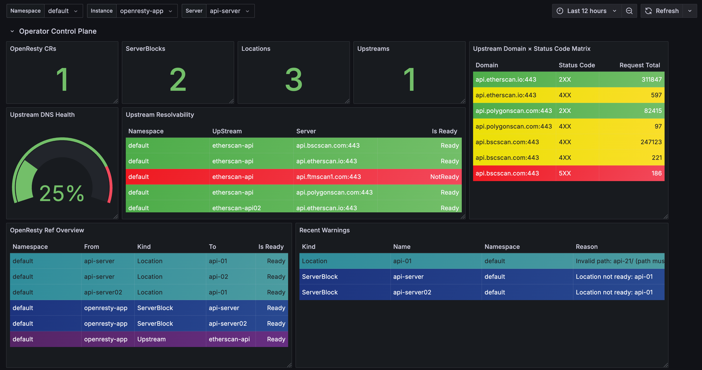
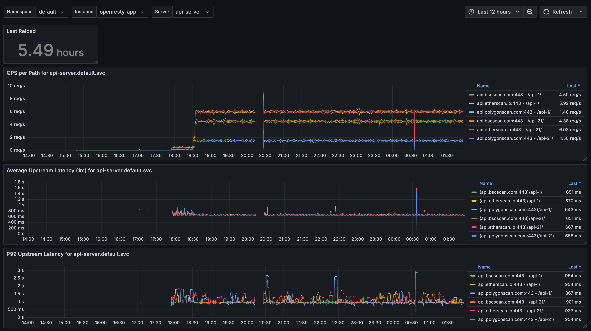

English | [中文](./README.zh-CN.md)

<p align="center">
  
</p>
<p align="center">
  <b>A lightweight Kubernetes Operator for managing OpenResty as an internal API gateway.</b>
</p>


# OpenResty Operator


[](https://artifacthub.io/packages/search?repo=openresty-operator)

## TL;DR

🚀 **OpenResty Operator** is a lightweight Kubernetes Operator for managing OpenResty (Nginx) as an internal API gateway.

✅ **Designed for teams proxying many third-party APIs** with minimal overhead and maximum transparency.  
🛠️ **Declarative via CRDs**: Configure `Location`, `ServerBlock`, and `Upstream` as native Kubernetes resources.  
🔁 **Hot-reload without restart**: Built-in agent applies config changes instantly.  
📊 **Prometheus-ready**: Metrics like upstream health, DNS resolution, and config status out of the box.  
🎯 **No etcd, no admin API, no bloat**—just OpenResty + this Operator.

## Is This For You?

✅ You're managing many third-party APIs in internal systems  
✅ You want GitOps-native, CRD-driven configuration over GUI  
✅ You prefer lightweight Nginx/OpenResty setups with transparency  
✅ You find APISIX/Kong overkill for internal API proxy scenarios

## Why OpenResty + Operator?

This project aims to provide an **infrastructure-friendly** alternative by:

- **Staying close to native Nginx configuration**: All logic is defined at the raw configuration level, fully aligned with OpenResty/Nginx syntax, ensuring full transparency and control.
- **Modular abstraction via CRDs**: Resources like `Location`, `ServerBlock`, and `Upstream` are modeled as independent CRDs with clearly defined relationships and version control.
- **Native Kubernetes ecosystem compatibility**: Designed to work seamlessly with GitOps tools like ArgoCD and Flux.
- **Minimal dependencies, production ready**: Requires only the OpenResty image and this Operator—no etcd or additional services.

> This Operator is independently developed and maintained based on recurring pain points from real-world API integration projects.

## Key Features

- **Flexible configuration modeling**  
  Uses CRDs to represent Nginx structures like `Location`, `ServerBlock`, and `Upstream`. Especially useful for managing large sets of third-party APIs that are distributed and hard to maintain.

- **Automated configuration rendering and deployment**  
  Automatically combines configuration blocks to generate the final `nginx.conf` and deploys it as an OpenResty instance.

- **Hot-reload on configuration change**  
  Includes a built-in reload agent to apply configuration changes without restarting the container.

- **Reference validation and version tracking**  
  CRD relationships are version-aware and readiness-checked to ensure consistent and traceable references.

- **Built-in observability**  
  Exposes Prometheus metrics out-of-the-box to visualize upstream health and configuration status.

## Getting Started

### 1. Install the Operator

**Recommended**: install via Helm.

```bash
helm repo add openresty-operator https://huangzehong.me/openresty-operator
helm install openresty openresty-operator/openresty-operator
```

Alternatively, install from source using raw manifests:

```bash
kubectl apply -f config/crd/bases/
kubectl apply -k config/smaples/
```

### 2. Define configuration CRDs

A basic example of `Location`, `ServerBlock`, and `Upstream`:

```yaml
apiVersion: openresty.huangzehong.me/v1alpha1
kind: Location
metadata:
  name: location-sample
spec:
  entries:
    - path: /sample-api/
      proxyPass: http://upstream-sample/
      enableUpstreamMetrics: true
      headers:
        - key: Host
          value: $host
        - key: X-Real-IP
          value: $remote_addr
        - key: X-Forwarded-For
          value: $proxy_add_x_forwarded_for
        - key: X-Forwarded-Proto
          value: $scheme
        - key: X-Content-Type-Options
          value: nosniff
        - key: Access-Control-Allow-Origin
          value: "*"
      accessLog: false
---
apiVersion: openresty.huangzehong.me/v1alpha1
kind: ServerBlock
metadata:
  name: serverblock-sample
spec:
  listen: "80"
  locationRefs:
    - location-sample
---
apiVersion: openresty.huangzehong.me/v1alpha1
kind: Upstream
metadata:
  name: upstream-sample
spec:
  servers:
    - example.com:80
    - www.baidu.com:443
    - invalid.domain.local:8080
```

### 3. Create an OpenResty instance

```yaml
apiVersion: openresty.huangzehong.me/v1alpha1
kind: OpenResty
metadata:
  name: openresty-sample
spec:
  image: gintonic1glass/openresty:with-prometheus
  http:
    include:
      - mime.types
    logFormat: |
      $remote_addr - $remote_user [$time_local] "$request" ...
    clientMaxBodySize: 16m
    gzip: true
    extra:
      - sendfile on;
      - tcp_nopush on;
    serverRefs:
      - serverblock-sample
    upstreamRefs:
      - upstream-sample
  metrics:
    enable: true
    listen: "8080"
    path: "/metrics"
```

## 📈 Metrics and Observability

OpenResty Operator exports a range of Prometheus metrics to help monitor config status and traffic health. It's compatible with standard observability stacks like Prometheus + Grafana:

- `openresty_crd_ref_status`: Track cross-CRD references and readiness (e.g., ServerBlock → Location).
- `openresty_upstream_dns_ready`: Report DNS resolution status of upstream servers.
- `openresty_request_total`, `openresty_response_status`: Analyze traffic volume and HTTP code distributions.
- Business-level metrics can be extended via embedded Lua blocks.

## 📊 Grafana Dashboard Preview

OpenResty Operator metrics can be visualized via Grafana. Below is an example panel showing:

- CRD instance counts and readiness status
- Upstream DNS health and response rates
- Recent config validation errors and alerts (e.g., path collisions, DNS failures)





> 📊 An official Grafana dashboard is available for monitoring OpenResty Operator via Prometheus.  
> You can download it from: [Grafana Labs Dashboard #23321](https://grafana.com/grafana/dashboards/23321)


## License

MIT License. See [LICENSE](LICENSE) for full details. 
