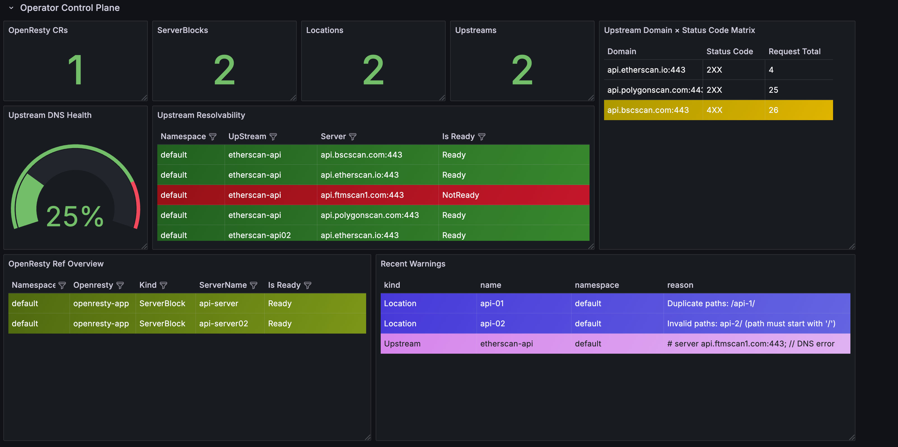

<p align="center">
  
</p>
<p align="center">
  <b>A lightweight Kubernetes Operator for managing OpenResty as an internal API gateway.</b>
</p>

# OpenResty Operator


**OpenResty Operator** 是一个基于 Kubernetes 的轻量级控制器，用于自动管理和部署 OpenResty 实例，通过声明式方式组织 location、upstream、server 配置，实现统一的第三方 API 网关能力。

该项目由我个人独立设计与开发，起因是一个在实际工作中经常遇到的问题：

在很多中小型公司或开发团队中，业务对第三方 API 的依赖非常重，但现有的网关方案往往存在以下几个问题：

- **资源消耗过高**：例如 APISIX 默认依赖 etcd 作为配置中心，虽然功能强大，但对部署环境的资源和稳定性要求较高；
- **运维与学习成本高**：如 Kong、APISIX 都内置了 Admin API，需要进行接口权限控制、认证管理，有时还需结合具体业务进行二次开发；
- **定制能力不足或过于封装**：很多方案将核心行为隐藏在插件中，虽然便捷，但不利于对每一层逻辑的细粒度掌控。

## 为什么选择 OpenResty + Operator？

我希望构建一个更加 **Infrastructure-Friendly** 的方案：

- **基于 OpenResty 原始配置层级**：配置即 Nginx，完全对标原生语法，具备更强的可控性；
- **模块化资源抽象**：以 CRD 表达 `Location`、`ServerBlock`、`Upstream` 等核心组件，具有清晰的引用逻辑与版本控制；
- **Kubernetes 原生生态兼容**：天然支持 GitOps 管理，方便与 ArgoCD / Flux 等工具集成；
- **零依赖、可落地**：无需额外组件，只需 OpenResty 镜像和 Operator 即可运行。

## 功能特性

- **灵活的配置建模**  
  使用 `Location`、`ServerBlock`、`Upstream` 等 CRD 描述 Nginx 配置结构，支持任意组合，适用于数量多、分布广、维护难度高的第三方 API 管理场景。

- **自动渲染与部署**  
  基于 `OpenResty` 自动拼接多个配置块，生成统一的 `nginx.conf` 并部署为 OpenResty 实例。

- **配置变更热更新**  
  内置`reload agent`，无需重启容器，即可动态应用配置变更。

- **引用校验与版本控制**  
  配置引用支持 version、ready 校验机制，确保资源引用始终一致、可追踪。

- **原生监控集成**  
  内置 Prometheus metrics 采集能力，可视化展示 upstream 状态与资源引用等状况。

## 快速开始

### 1. 安装 Operator

推荐方式：使用 Helm 安装。

```bash
helm repo add openresty-operator https://huangzehong.me/openresty-operator
helm install openresty openresty-operator/openresty-operator
```

如果你从源码部署，也可以直接应用原始 YAML：

```bash
kubectl apply -f config/crd/bases/
kubectl apply -k config/default/
```

### 2. 定义配置资源

示例：一个简单的 Location 配置。

```yaml
apiVersion: openresty.huangzehong.me/v1alpha1
kind: Location
metadata:
  name: hello
spec:
  entries:
    - path: /hello
      proxyPass: http://example.com
```

### 3. 创建 OpenResty 实例

```yaml
apiVersion: openresty.huangzehong.me/v1alpha1
kind: OpenResty
metadata:
  name: demo-app
spec:
  replicas: 2
  serverRefs:
    - name: demo-server
  http:
    accessLog: /dev/stdout
```

## 📈 指标与监控

OpenResty Operator 默认导出多种 Prometheus 指标，便于观测配置状态与流量健康状况，适配常见的云原生监控栈（Prometheus + Grafana）：

- `openresty_crd_ref_status`：追踪各类 CRD（如 ServerBlock、Location、Upstream）之间的引用关系和就绪状态。
- `openresty_upstream_dns_ready`：展示 upstream DNS 解析成功率与可达性。
- `openresty_request_total` 与 `openresty_response_status`：分析各个 upstream 的请求量与状态码分布。
- 支持通过 Lua 扩展自定义业务级 metrics。

## 📊 Grafana Dashboard 示例

OpenResty Operator 默认导出 Prometheus 指标，可用于构建如下监控面板



该仪表盘展示了：

- CRD 数量、Ready 状态、引用结构
- Upstream 的 DNS 健康度和响应情况；
- 近期配置异常与告警事件（如路径冲突、域名无法解析等）

## 项目结构

```bash
.
├── api/              # CRD 定义
├── charts/           # Helm Chart
├── config/           # Kustomize 安装文件
├── controllers/      # Operator 控制逻辑
└── docs/             # 使用文档与架构说明
```


## 许可证

MIT License. 详见 [LICENSE](LICENSE)。